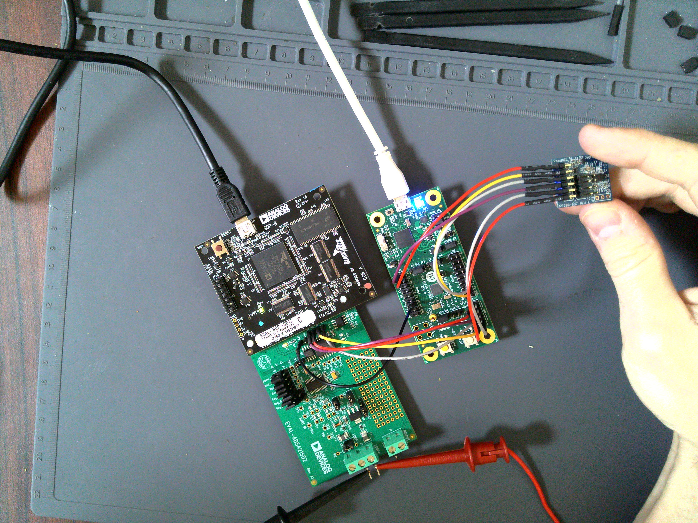
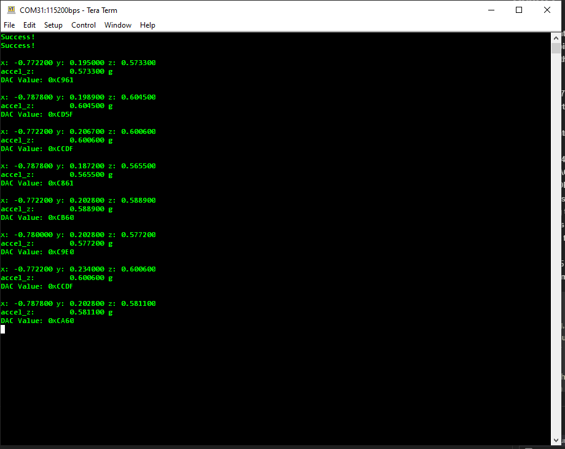
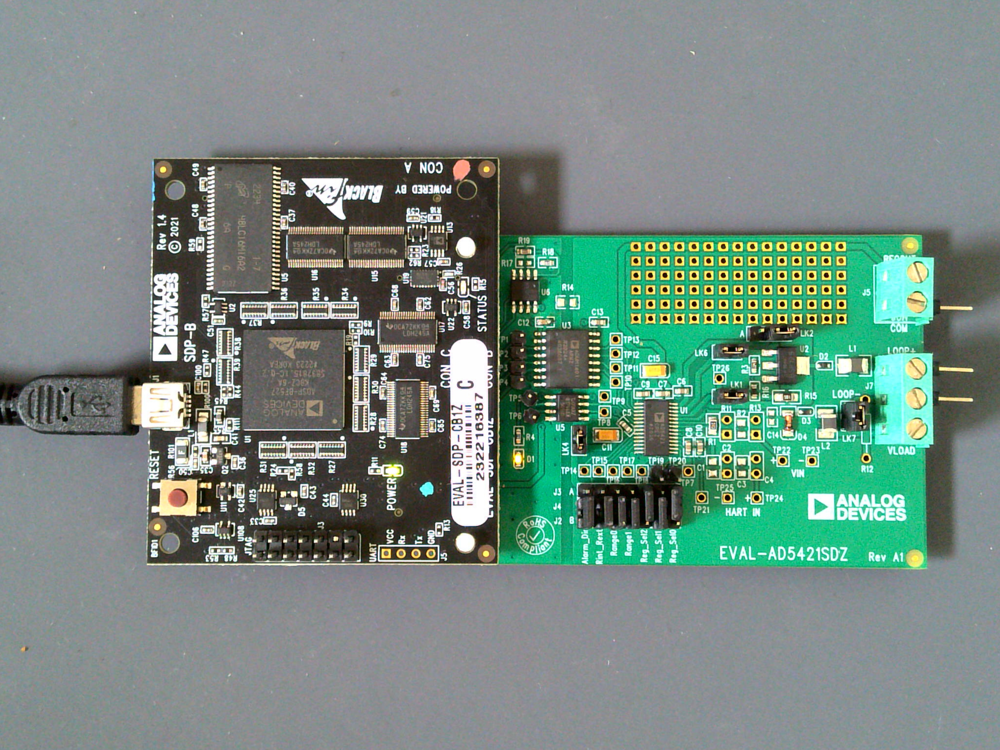
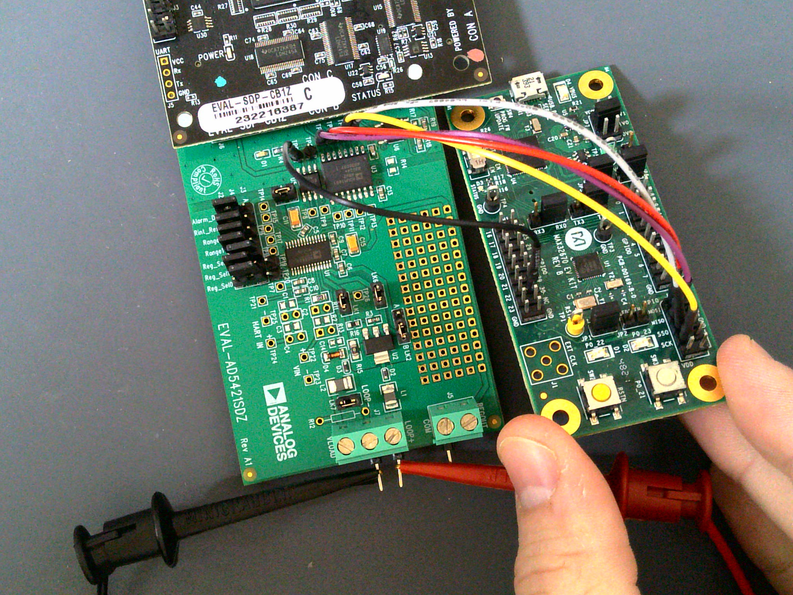
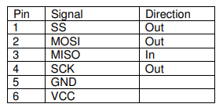
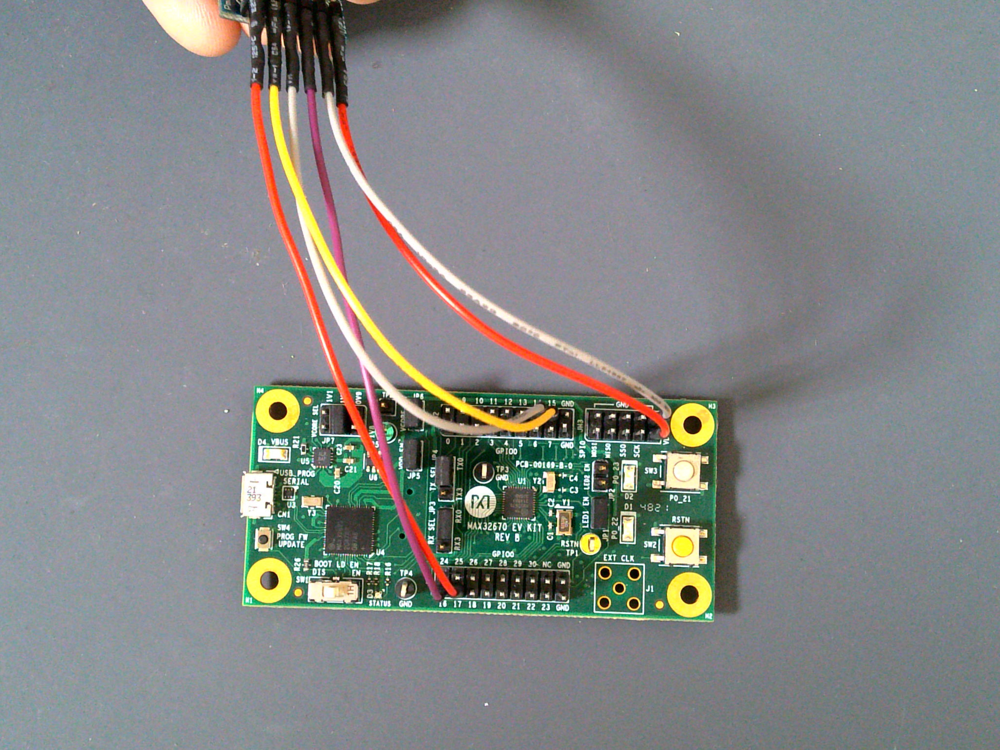
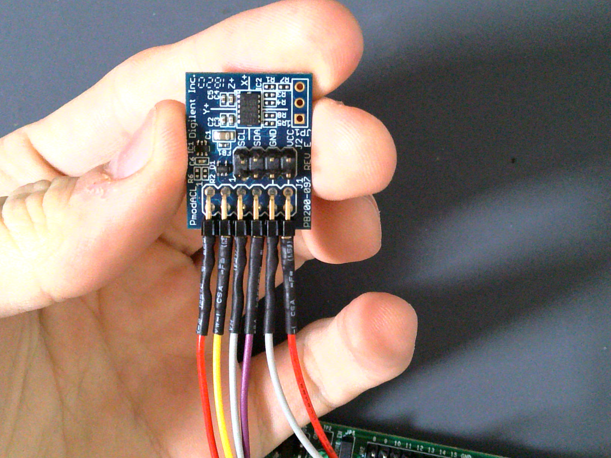
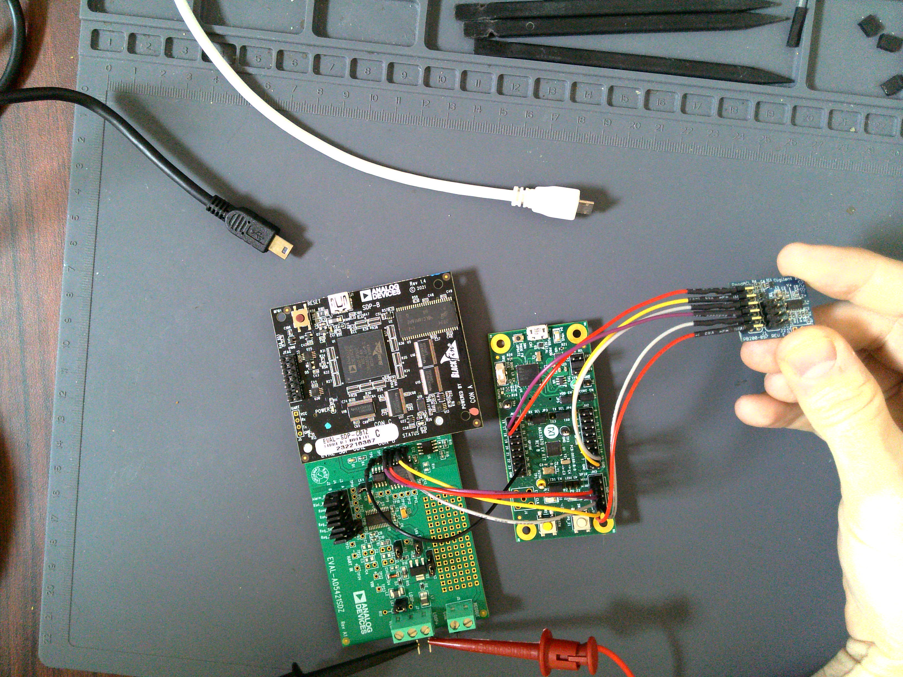

# 4-20mA Accelerometer-Correlated Industrial Output

This project uses the MAX32670 microcontroller with the ADXL345 accelerometer and AD5421 4-20mA DAC. The DAC output is correlated to the Z-axis of the accelerometer because it's usually the easiest to think about. When the ADXL IC is sitting flat on a table, for example, the normal vector in the Z-direction points fully up giving a normalized dot product of 1. Therefore, under these conditions the Z component of the ADXL output is +1.0. If you flip the ADXL, the Z component goes to -1.0.





## Hardware Setup

### Boards
There are 4 boards currently involved in doing the setup for this project.

- MAX32670 ARM Cortex M4F Microcontroller
- AD5421 4-20mA DAC
- EVAL-SDP-CB1Z (just for powering the AD5421's DVDD at the moment)
- ADXL345 Accelerometer

> [!note]
> Before proceeding, please ensure the "BOOT LD EN" switch on the MAX32670 EV Kit is set to "DIS" to disable the bootloader.

### AD5421 Setup

#### Power

To setup the AD5421 DAC, the Eval-SDP-CB1Z board must be used to power the AD5421 board at this time. There are multiple SDP connectors on the SDP board; please verify the connection with the below image before plugging in power. Also, please disconnect power before proceeding with this guide to avoid damaging boards.



> [!warning]
> Please disconnect power from all sources before continuing.
>
#### Soldering for the AD5421

To work with the AD5421, TP1-6 (for SPI and FAULTIN/LDAC) and TP19 should be soldered in. TP19 is just so the boards can directly share a GND pin, and also depends on the position of the Reg_Sel1 jumper (do NOT move this jumper unless you use a different test point for the GND).

- TP1 - !SS0 / !SYNC
- TP2 - SCLK
- TP3 - SDI / MOSI
- TP4 - SDO / MISO
- TP5 - FAULTIN
- TP6 - !LDAC

- TP19 - GND. Can also use COM, but this avoid bringing any jumpers close to the exposed supply.

#### SPI Connection

The EVAL-AD5421SDZ platform must be connected to the SPI0 bus on MAX32670. There are silkscreen markings for SPI0 on the MAX32670 EVKit. Connect them as follows for AD5421:

- SS0 --> TP1
- SCK --> TP2
- MOSI --> TP3
- MISO --> TP4
- LDAC (GPIO P0.30 or GND) --> TP6
- FAULTIN (optional) --> TP5 (unused, may be monitored with an oscilloscope)
- GND (COM or TP19) - Any GND pin on the MAX32670 EVKit



#### Jumper Settings for the AD5421

The following jumpers are set by default for the AD5421 kit:

- LK1
- LK2 --> Position B
- LK4
- LK6
- LK7 (use onboard resistor if not provided externally on LOOP+/LOOP-)

### ADXL345 Setup

#### Connecting ADXL345 to MAX32670

The ADXL345 connects to MAX32670 over SPI1. This uses the following pins:

- V_AUX / GND
- P0.14 (MISO)
- P0.15 (MOSI)
- P0.16 (SCK)
- P0.17 (SS0)

If using a [Pmod™](https://digilent.com/reference/_media/reference/pmod/digilent-pmod-interface-specification.pdf) evaluation platform for the Accelerometer such as the [PmodACL](https://digilent.com/reference/pmod/pmodacl/start), the Pmod™ SPI standard interface can be used to connect the accelerometer. Pmod™ is a registered trademark of Digilent, Inc.






### Final HW Setup

The final hardware setup between Eval Kits looks like the below:



Finally, connect a 6-24V, >20 mA supply to LOOP+/LOOP- on the AD5421 kit. Connect both USB ports and turn on the supply. If the Serial port output shows an error due to supply sequencing, try resetting the MAX32670 via the RSTN button (SW2).

## Building the Software

The software is built using ADI's [No-OS](https://github.com/analogdevicesinc/no-OS) software framework. This requires an installation of the MaximSDK on the system to use the low-level Hardware-Access-Layer (HAL) drivers for the MAX32 parts. After fully installing the MSDK, setup No-OS to build for "Maxim" devices. Please review the following guides for the setup:

[MSDK Installation Guide](https://analogdevicesinc.github.io/msdk//USERGUIDE/#installation)
[No-OS Build Guide](https://wiki.analog.com/resources/no-os/build?s[]=lts&s[]=tleb&s[]=ittpsh&s[]=giteshipg&s[]=home)

### Install MSDK

Please follow the MSDK Installation Guide link above completely to install the MSDK for MAX32 microcontrollers.

### Setup No-OS

> [!note]
> To build this application, the author uses [MSYS2](https://www.msys2.org/) via [Git Bash](https://git-scm.com/downloads).
> To avoid conflating environments, it may be wise to try using an MSYS2 environment when buiding the software.
>
> A few tools are needed to build the program besides MSDK / No-OS:
>   - GNU Make
>   - Git (for cloning No-OS)
>
> These can be installed by calling `pacman -S git mingw-w64-x86_64-make` in an MSYS2 environment.

Please follow the No-OS guide with the "Maxim" setup for your operating system (e.g. Windows--> Maxim). The steps are re-printed below targeting a Windows setup to add clarity. MSYS2 is used by the author as the primary Windows environment.


- Install MSDK

- Clone no-OS recursively ( `git clone --recursive <url>` )
- Open the project on command-line ( `cd no-OS/projects/z-adxl-max32670-ad5421/` )
- Set MAXIM_LIBRARIES environment variable ( ` export MAXIM_LIBRARIES=/c/MaximSDK/Libraries` if using MSYS2 )
- Set the environment variables for the PLATFORM and TARGET. ( `export PLATFORM=maxim TARGET=max32670` )
- Finally, type "`make -j10`" into the command-line.

> [!warning]
>  - If you get the error `*** multiple target patterns. Stop.`, it is most likely because of the ':' in the MAXIM_LIBRARIES environment variable. This cause Make to think there is more than one application to build (the ':' character is a separator in GNU Make). Using MSYS2, make sure you supply `/c/` as the path to your Windows hard drive e.g `MAXIM_LIBRARIES=/c/MaximSDK/Libraries`.
>  - If rebuilding the application, it's wise to fully delete the `build/` folder between builds due to the way No-OS's build system works. Ensure every build starts fresh this way before attempting to re-build the software.

## Flashing the Software

With the MAX32670 EVKit connected via USB port, the software can be flashed by calling `make run` from the project folder. The MAX32670 EV Kit should enumerate as a USB device called "CMSIS-DAP", and show up similar to a USB Flash Drive under `This PC` in Windows File Explorer.

```
# Log of "make run" Output

$ make run

[11:25:54] Building for maxim
[11:25:54] Done (build/z-adxl-max32670-ad5421.elf)
Open On-Chip Debugger (Analog Devices 0.12.0-1.0.0-7)  OpenOCD 0.12.0 (2023-09-27-07:53)
Licensed under GNU GPL v2
Report bugs to <processor.tools.support@analog.com>
DEPRECATED! use 'adapter driver' not 'interface'
DEPRECATED! use 'adapter srst delay' not 'adapter_nsrst_delay'
DEPRECATED! use 'adapter srst pulse_width' not 'adapter_nsrst_assert_width'
Info : CMSIS-DAP: SWD supported
Info : CMSIS-DAP: Atomic commands supported
Info : CMSIS-DAP: Test domain timer supported
Info : CMSIS-DAP: FW Version = 2.0.0
Info : CMSIS-DAP: Serial# = 0423170264fa4de900000000000000000000000097969906
Info : CMSIS-DAP: Interface Initialised (SWD)
Info : SWCLK/TCK = 1 SWDIO/TMS = 1 TDI = 0 TDO = 0 nTRST = 0 nRESET = 1
Info : CMSIS-DAP: Interface ready
Info : clock speed 2000 kHz
Info : SWD DPIDR 0x2ba01477
Info : [max32xxx.cpu] Cortex-M4 r0p1 processor detected
Info : [max32xxx.cpu] target has 6 breakpoints, 4 watchpoints
Info : starting gdb server for max32xxx.cpu on 3333
Info : Listening on port 3333 for gdb connections
[max32xxx.cpu] halted due to debug-request, current mode: Handler HardFault
xPSR: 0xa1000003 pc: 0x10009376 msp: 0x2001ff00
Warn : [max32xxx.cpu] Only resetting the Cortex-M core, use a reset-init event handler to reset any peripherals or configure hardware srst support.
[max32xxx.cpu] halted due to debug-request, current mode: Thread
xPSR: 0x01000000 pc: 0x000001b4 msp: 0x20004000
** Programming Started **
** Programming Finished **
** Verify Started **
** Verified OK **
** Resetting Target **
Warn : [max32xxx.cpu] Only resetting the Cortex-M core, use a reset-init event handler to reset any peripherals or configure hardware srst support.
shutdown command invoked
[11:26:00] z-adxl-max32670-ad5421.elf uploaded to board
```

## Connecting to the Serial Port

The serial port on the MAX32670 EV Kit comes through the USB connector and using 115200 baud, 8 bits, No Parity, 1 Stop bit (8-N-1) settings. To view the serial port output, use a serial monitor such as [TeraTerm](https://teratermproject.github.io/index-en.html) or any functional equivalent. A USB COM port should show up with the USB Name "mbed Serial Port". Connect to this and you should see the accelerometer output and corresponding DAC value being printed repeatedly.


Otherwise, the application has most likely hit an error and stopped printing. This can be due to any of the devices having a communication problem, or the AD5421 hits a FAULT, for example. Press the RSTN button on the MAX32670 EV Kit to restart the application.
